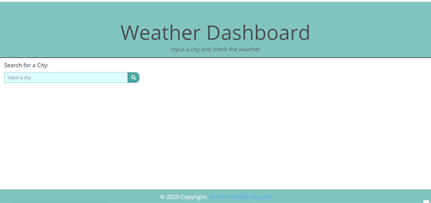
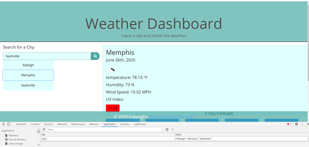

# Weather Dashboard

* A weather dashboard that will run in the browser and feature dynamically updated HTML and CSS.

# Description

* Developed using bootstrap, jQuery and dynamically updating the html and css
* Accepts user input of any city and upon searching that city name will retrieve weather information
* Using server-side technologies or API from openweather.org created a current weather and forecast of weather for 5 days
* User can look-up multiple cities and click back and forth to see the weather conditions

# Mock up of Project 

* Used documentation and api keys from openweathermap.org to retrieve weather data the following is a mock up 
* The following image demonstrates the application functionality:


# Weather Dashboard

* Home page ---
* When the weather dashboard url is opened the user is presented with a header description of page
* User has the ability to input a city and search the city for weather information
* When the city is searched a button is displayed with the city name in it
* after adding the cities the buttons will persist on the page and can be clicked to see the current weather and a five day forecast for that city
* Deployed URL: https://victorsc45.github.io/Weather-Dashboard/

# Spec Criteria

* Weather dashboard with user form inputs to search for a city's weather conditions
* User is presented with current weather and five day forecast.
* User is presented with the city name, the date, an icon representation of weather conditions, the temperature, the humidity,  
    the wind speed, and the UV index
* UV index is presented with a color that indicates whether the conditions are favorable, moderate, or severe
* User presented with a 5-day forecast that displays the date, an icon representation of weather conditions, the temperature, and the humidity
* User may search multiple cities and as they search them the a buttons will be created with the city name
* The button created when city is searched persists with the city name in it and when clicked again displays the current and forecast 
    weather for that city

# Minimum Requirements
* Weather dashboard that uses openweathermaps.org api to fetch data using ajax calls 
* The user can search as many cities as they would like and the city data input will persist in local storage 
* When consuming the api data by ajax query; multiple arrays in the data are accessed to  present the current weather per city and a 5 day forecast
* append the DOM with jQuery and present the data from the api calls
* When the buttons are created dynamically they are put into local storage and when the page is refreshed they remain on the view
* Functional deployed application
* Github repository with a README.md discribing the project
* Must use bootstrap for responsive sizing

# Instulation

N/A at this time simply follow the url provided above plan the day by saving entries to the page


# Review
Application opened by Deployed URL above 
User is presented with banner that explains that they can search for the weather of any city
User may search as many city as they like
When searched a button with the city name is dynamically created and when that button is pressed the user is presented with 
    dynamically created weather conditions for that city 
The city buttons persist and can be clicked again to reveal the current weather and five day forecast again

# Credits

'''' https://learn.jquery.com/using-jquery-core ''''

'''' The [Moment.js](https://momentjs.com/) library to work with date and time. ''''

'''' https://developer.mozilla.org/en-US/docs/Web/HTML ''''

'''' https://www.w3.org/standards/webdesign/accessibility ''''

'''' bootstrap components link starting 'A' and descending 

'''' https://getbootstrap.com/docs/4.5/components/alerts/ ''''

'''' https://stackoverflow.com/questions/45696685/search-input-with-an-icon-bootstrap-4 ''''

''''  http://designph24.blogspot.com/ ''''

'''' [OpenWeather API](https://openweathermap.org/api) ''''

##  /askBCS @artanmuzhaqi learning assistant :)

# License 

Open to the public website for Weather Dashboard 

# Test

* text going to the URL above and searching cities weather
* Check that the enteries are saved by refreshing the page or accessing:
    * the local storage / check local storage in console > application > Localstorage

* Home page presentation:



* Local Storage Image test:



* Code snippet for ajax call used in this project

```javascript
  // Creating an AJAX call for specific city's weather

        $.ajax({

            url: queryURL,

            method: "GET",

            // error function to validate user input to textbox

            error: function () {
                alert("city not found enter another city");
                deleteBtn();
            }

        }).then(function (response) {


            // fetch api data and convert to variables
            let cityName = response.city.name;
            let Date = response.list[0].dt_txt;
            let today = moment(Date).format('MMMM Do, YYYY');
            let temperature = response.list[0].main.temp;
            let humidity = response.list[0].main.humidity;
            let windSpeed = response.list[0].wind.speed


            // Transfer content to HTML and append to appropriate DOM element

            let cityH2 = $("<h2 class='cityCl'>").text(cityName);
            let citeDate = $("<p class='datecl'>").text(today);
            let weatherIcon = $("");
            let pOne = $("<p>").text("temperature:  " + temperature + " °F");
            let pTwo = $("<p>").text("Humidity:  " + humidity + " %");
            let pThree = $("<p>").text("Wind Speed:  " + windSpeed + " MPH");

            // show media content that was hidden for a clean looking UI

            $(".media").show();

            //empty media body to replace with new appends

            $(".media-body").empty();
            $(".media-body").append(cityH2, citeDate, weatherIcon, pOne, pTwo, pThree);

```